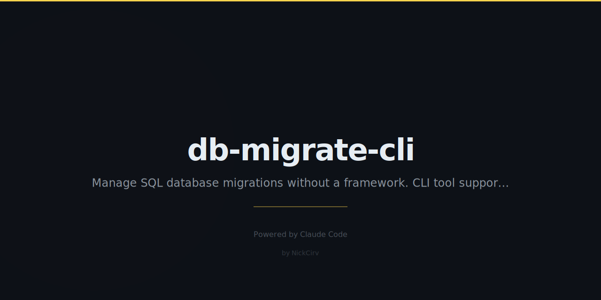

# db-migrate-cli

Zero-dependency SQL migration CLI. Manage database migrations (up/down/status/create) without a framework — works with any PostgreSQL or SQLite database.

## Features

- **Zero npm dependencies** — only Node.js built-ins
- **PostgreSQL** support via `psql` CLI
- **SQLite** support via `node:sqlite` (Node 22+) or `sqlite3` CLI fallback
- Migration tracking with SHA-256 checksums
- Transaction-wrapped migrations with automatic rollback on error
- `create`, `status`, `up`, `down`, `redo`, `validate` commands

## Requirements

- Node.js 18+
- For PostgreSQL: `psql` CLI installed
- For SQLite on Node < 22: `sqlite3` CLI installed

## Installation

```bash
npm install -g db-migrate-cli
```

Or use without installing:

```bash
npx db-migrate-cli --help
```

## Usage

```
db-migrate <command> [options]
dbm <command> [options]
```

### Commands

| Command | Description |
|---|---|
| `create <name>` | Create a new migration file |
| `status` | Show applied and pending migrations |
| `up [--count N]` | Run all pending migrations (or next N) |
| `down [--count N]` | Rollback last N migrations (default: 1) |
| `redo` | Rollback then re-apply the last migration |
| `validate` | Check migration files for SQL structure issues |

## Configuration

Set one of these in your environment:

```bash
# PostgreSQL via full URL
DATABASE_URL=postgres://user@localhost:5432/mydb

# SQLite via full URL
DATABASE_URL=sqlite:./dev.db

# SQLite via env vars
DB_DRIVER=sqlite
DB_FILE=./dev.db

# PostgreSQL via env vars
DB_DRIVER=postgres
DATABASE_URL=postgres://user@localhost:5432/mydb
```

> **Security:** Credentials are read from environment variables only. The CLI never logs or displays passwords or full connection strings.

## Migration File Format

Files are created in `./migrations/` with the pattern `YYYYMMDDHHMMSS_name.sql`:

```sql
-- Migration: add_users_table
-- Created: 2026-03-03T12:00:00.000Z

-- UP

CREATE TABLE users (
  id SERIAL PRIMARY KEY,
  email TEXT NOT NULL UNIQUE,
  created_at TIMESTAMPTZ NOT NULL DEFAULT NOW()
);

-- DOWN

DROP TABLE users;
```

## Examples

```bash
# Create a new migration
db-migrate create add_users_table

# Check status
DB_DRIVER=sqlite DB_FILE=./dev.db db-migrate status

# Run all pending migrations
DATABASE_URL=postgres://user@localhost/mydb db-migrate up

# Run next 2 only
db-migrate up --count 2

# Rollback last migration
db-migrate down

# Rollback last 3
db-migrate down --count 3

# Redo last migration
db-migrate redo

# Validate all migration files
db-migrate validate
```

## How It Works

1. Migrations live in `./migrations/` as `.sql` files, sorted by timestamp
2. Applied migrations are tracked in a `_migrations` table in your database
3. Each migration is run inside a transaction — on error, it rolls back automatically
4. File checksums (SHA-256) are stored so you can detect if a migration was modified after being applied

## License

MIT
